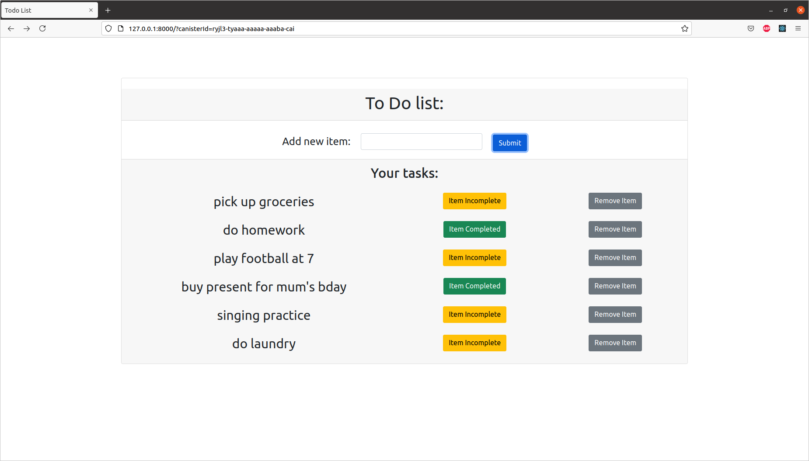

# todo_app

## Description of the app:
This application enables a user to add and delete items from their todo list. This appplication was developed using the Internet Computer, the Motoko programming language as well as React. 

## How to run the app?
To run the project on a local network, clone the github repository and follow the guidelines from the available documentation:
 - https://sdk.dfinity.org/docs/quickstart/local-quickstart.html

